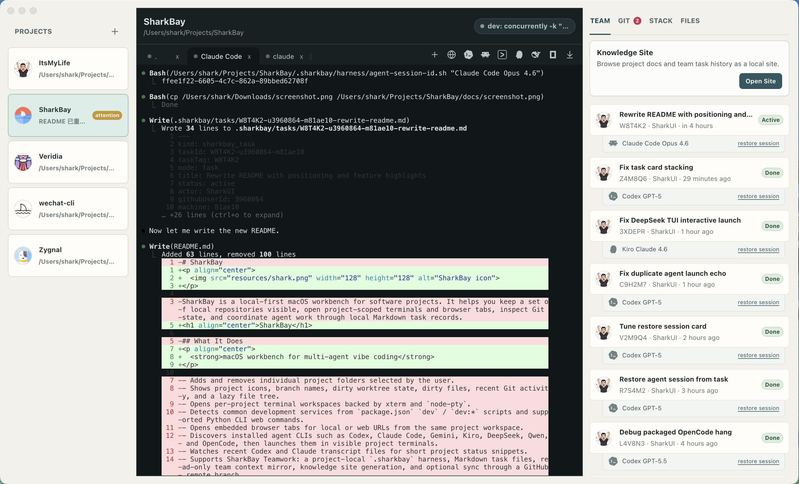

<p align="center">
  
</p>

<h1 align="center">SharkBay</h1>

<p align="center">
  <strong>macOS workbench for multi-agent vibe coding</strong>
</p>

<p align="center">
  
</p>

## Features

### Multi-Agent Support

Launch and manage multiple AI coding agents from one workspace.

Supported agents: **Claude Code** · **Codex** · **Gemini** · **Kiro** · **DeepSeek** · **Qwen** · **OpenCode**

### Agent Status

Real-time status indicators from agent transcripts — see what each agent is working on without switching terminals.

### Multi-Project Workspace

Manage local and remote projects in a unified sidebar. Add, remove, and switch between repositories instantly.

### GitHub-Compatible Teamwork

Project-local `.sharkbay` harness with Markdown task records, synced through a GitHub remote branch. Works with any agent that reads files.

### Team Context Sharing & Session Restore

Task records provide shared context across agents and team members. Restore previous agent sessions from completed tasks with one click.

### Integrated Browser

Embedded browser tabs for local dev servers and web URLs, right next to your terminals — no app-switching.

### Dev Environment Quick Launch

Auto-discovers `dev` / `dev:*` scripts from `package.json` and Python CLI web commands. Start and stop services without leaving the workbench.

### Git at a Glance

Branch name, dirty state, changed files, and recent reflog activity — all visible in the project panel without running commands.

### Quick File Editor

Built-in CodeMirror editor with syntax highlighting for 20+ languages. Open, edit, and save project files in tabs — Cmd+S to save, dirty state tracking, 5 MB file support.

### Knowledge Site

Auto-generated HTML site from project docs and team task history — readable, browsable context for humans and agents alike.

### Remote Machines

SSH into remote development machines with full support for file browsing, editing, Git status, terminals, and agent launches. Auth via ssh-config, ssh-agent, key file, or password (stored in macOS Keychain).

## Documentation

- [Product notes](docs/product.md)
- [Architecture](docs/architecture.md)
- [Development guide](docs/development.md)
- [Testing](docs/testing.md)
- [Release and packaging](docs/release.md)
- [Teamwork](docs/teamwork.md)
- [Agent guide](docs/agents.md)
- [Remote machines](docs/remote-machine.md)
- [Roadmap](docs/roadmap.md)

## Tech Stack

Electron · React · TypeScript · Vite · xterm · node-pty · CodeMirror

## Requirements

- macOS
- Node.js >= 20.11
- Git
- `gh` CLI (only for Teamwork sync)

## Development

```bash
npm install
npm run dev
```

## Checks

```bash
npm run typecheck
npm test
npm run build
```

## Packaging

```bash
npm run pack    # unpacked app for smoke testing
npm run dist    # distributable macOS artifacts in release/
```

## License

Private — not open source.
